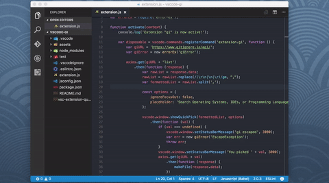
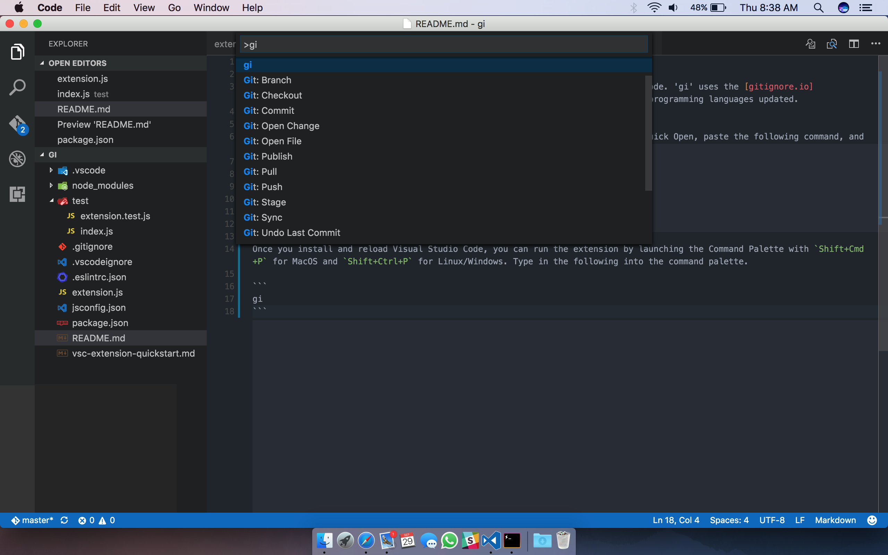
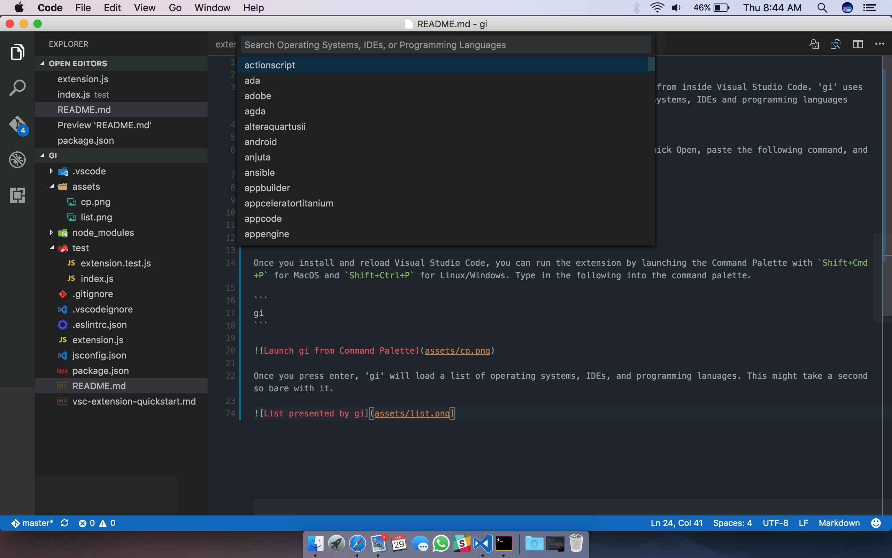

# gi

'gi' stands for 'gitignore'. It is an extension for generating .gitignore files from inside Visual Studio Code. 'gi' uses the [gitignore.io](https://www.gitignore.io) API to keep the list of operating systems, IDEs and programming languages updated.



## Install
For MacOS press `Cmd+P` and or Linux/Windows press `Ctrl+P` to launch VS Code Quick Open, paste the following command, and press enter.

```
ext install gi
```

## Usage

Once you install and reload Visual Studio Code, you can run the extension by launching the Command Palette with `Shift+Cmd+P` for MacOS and `Shift+Ctrl+P` for Linux/Windows. Type in the following into the command palette.

```
gi
```



Once you press enter, 'gi' will load a list of operating systems, IDEs, and programming lanuages. This might take a second so bare with it.



You can search for (yay `showQuickPick()`!) the operating system, IDE, or programming lanuage you want to generate a .gitignore file for. Even though I would like for you (the user) to be able to pick multiple items from the list, it is currenly not supported by [vscode namespace API](https://code.visualstudio.com/docs/extensionAPI/vscode-api). I have put in a feature request [here](https://github.com/Microsoft/vscode/issues/12925), but it seems that it has been on the todo list for quite some time now [here](https://github.com/Microsoft/vscode/issues/238).

## Todo 

- Add tests.
- Add multi-select support to list.
- Overall code clean up and better structure.

## Contributing

This is my very first extention for Visual Code Studio. If you find the code to be bug ridden, with mistakes or just plain old amazing, send in a word. You are welcome to comment/ask questions/post issues/send PRs on the [Github page](https://github.com/hasit/vscode-gi). 

## Note

This is in no way associated with [gitignore.io](https://www.gitignore.io). 'gi' only uses the API exposed by [gitignore.io](https://www.gitignore.io). I made this extension as a learning experience.